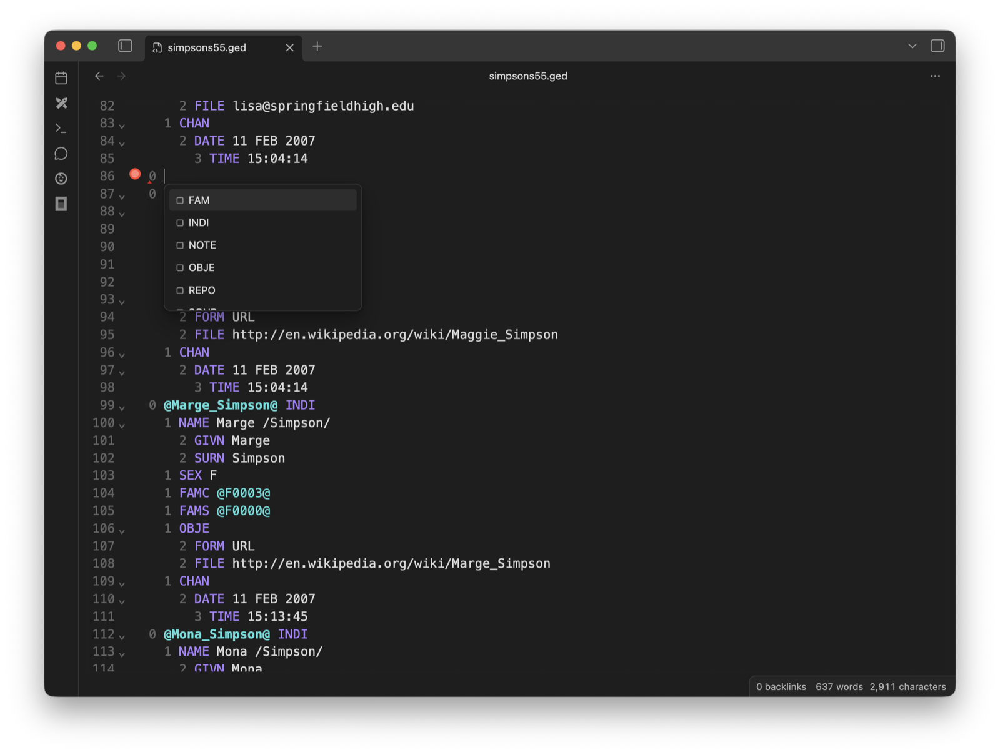

# Domorium GEDCOM Editor

Edit source `.ged` and `.gedcom` files directly in Obsidian with validation,
autocomplete, navigation, folding, and semantic highlighting.



## Features

- Context-aware GEDCOM tag autocomplete
- Real-time validation errors and warnings
- Semantic highlighting for levels, tags, and cross-references
- Documentation tooltips for GEDCOM tags
- Go to definition for XREF values
- Folding and visual indentation for nested records
- Desktop and mobile Obsidian support

Domorium keeps the GEDCOM file as the source of truth. It does not convert
records into Markdown, create a second genealogy database, or send vault data
to a remote service.

## Beta installation

Until Domorium is available in Community Plugins, install the latest GitHub
release using [BRAT](https://github.com/TfTHacker/obsidian42-brat) and this
repository URL:

```text
https://github.com/lavich/domorium-obsidian
```

For a manual installation, copy `main.js`, `manifest.json`, and `styles.css`
from the latest release into:

```text
<vault>/.obsidian/plugins/domorium/
```

Reload Community Plugins and enable **Domorium GEDCOM Editor**.

## Development

```bash
npm install
npm test
npm run build
```

The packaged plugin is written to `dist/`.

The shared GEDCOM parser and editor-independent language service are maintained in the main
[Domorium repository](https://github.com/lavich/domorium). Their source is
included here so releases can be built and reviewed independently.

## License

MIT © 2025 Andrei Lobanov
