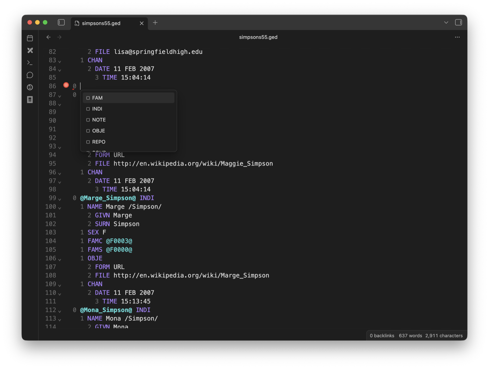

# GEDCOM for Obsidian

[](https://github.com/lavich/domorium-obsidian/releases)
[](LICENSE)

GEDCOM language support by Domorium. Edit source `.ged` and `.gedcom` files
directly in Obsidian with validation, autocomplete, navigation, folding, and
semantic highlighting.



Part of [Domorium](https://github.com/lavich/domorium). The same GEDCOM language
support runs in [VS Code](https://marketplace.visualstudio.com/items?itemName=domorium.gedcom),
[JetBrains IDEs](https://plugins.jetbrains.com/plugin/index?xmlId=domorium.gedcom),
and [in the browser](https://domorium.com/) — one implementation of the format,
adapted per editor.

## Features

- Context-aware GEDCOM tag autocomplete
- Real-time validation errors and warnings
- Semantic highlighting for levels, tags, and cross-references
- Documentation tooltips for GEDCOM tags
- Go to definition for XREF values
- Find XREF references and highlight declarations and usages
- Safe XREF rename as one undoable edit
- Web links and vault-relative file links
- Quick fixes for broken references and invalid levels
- Folding and visual indentation for nested records
- Highlighted and checked `gedcom` code blocks in notes
- Links from a note to a record, through `obsidian://domorium`
- Desktop and mobile Obsidian support

The plugin keeps the GEDCOM file as the source of truth. It does not convert
records into Markdown, create a second genealogy database, or send vault data
to a remote service.

## Usage

1. Enable **GEDCOM** in **Settings → Community plugins**.
2. Open a `.ged` or `.gedcom` file in your vault.
3. Edit the source directly. Obsidian saves changes back to the same file.

Use **Go to GEDCOM definition** from the command palette to jump from an XREF
usage to its record declaration. **Find GEDCOM references** moves between
matching declarations and usages, and **Rename GEDCOM reference** updates the
current XREF atomically. Editor behavior can be adjusted in the plugin settings.

A record pasted into a note is highlighted and checked when it is fenced as
`gedcom`. A block carries no header, so it is read as GEDCOM 7 unless the fence
names another specification — ```` ```gedcom 5.5.1 ````.

A note can link to a record. **Copy link to record** puts an
`obsidian://domorium?vault=…&file=…&xref=@I47@` link on the clipboard; opening it
opens the file with the cursor on that record.

## For dataviewjs and other plugins

The parsed document is reachable without opening the file:

````
```dataviewjs
const api = app.plugins.plugins["domorium"].api;
const tree = await api.read("family/tree.ged");
dv.list(tree.getNodes().filter((n) => n.tokens.TAG?.value === "INDI")
  .map((n) => tree.getLabel(n) ?? n.tokens.XREF?.value));
```
````

`api.parse(text, options)` does the same for text already in hand. Both answer
with the validator's `GedcomDocument`: `getNodes`, `getErrors`, `getVersion`,
`getLabel`, `getPointerTargetTag`, `isRecordDeclaration`. `api.version` says
which API you are holding.

## Privacy

GEDCOM by Domorium works locally inside the vault. It does not require an account, make
network requests, access files outside the vault, show advertisements, or
collect analytics or telemetry.

## Installation

Install **GEDCOM** from Obsidian's Community Plugins directory. To test beta
releases, use [BRAT](https://github.com/TfTHacker/obsidian42-brat) with this
repository URL:

```text
https://github.com/lavich/domorium-obsidian
```

For a manual installation, copy `main.js`, `manifest.json`, and `styles.css`
from the latest release into:

```text
<vault>/.obsidian/plugins/domorium/
```

Reload Community Plugins and enable **GEDCOM**.

## Development

```bash
npm install
npm run check
```

The packaged plugin is written to `dist/`.

The shared GEDCOM parser and editor-independent language service are maintained in the main
[Domorium repository](https://github.com/lavich/domorium) and consumed as
versioned public npm packages.

## License

MIT © 2026 Andrei Lobanov

Domorium is an independent project and is not affiliated with or endorsed by
FamilySearch or Intellectual Reserve, Inc. FAMILYSEARCH GEDCOM™ and FAMILYSEARCH®
are trademarks of Intellectual Reserve, Inc.
